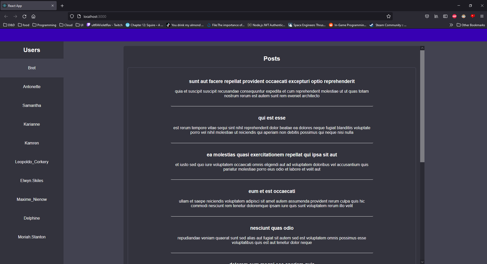

# Job Application Challenge

Using jQuery or vanilla JS you will display each 'USER' in a table. When the user selects a 'USER' in the table, it will display all of the 'POSTS' that were created by that 'USER'. You have full freedom in how you accomplish the above objectives. You also have full freedom as far as design is concerned. Please do not spend more than 2 hours on this task. Once completed, please upload your code to a Github repo and send us the link via Indeed chat.

## Time Constraints

| Activity     | Duration |                                                    link                                                    |
| :----------- | :------: | :--------------------------------------------------------------------------------------------------------: |
| Protyping    |   30m    | https://www.figma.com/proto/ocoaSWSKovJzFVpqAQGEEO/Untitled?node-id=17%3A3&scaling=min-zoom&page-id=17%3A2 |
| Coding       | 1hr 15m  |                                  https://github.com/M-Daley/post_display                                   |
| Interuptions |   10m    |

## Areas for Improvements

Things I would like to implement given more time.

- Middleware to track API/CSS crashs.
- Prepared Vanilla JS modules to reduce time consumption from writing/debugging boilerplate code.
- Loading animation for unloaded content instead of dummy content.
- CSS layouts for Tablet and Mobile breakpoints
